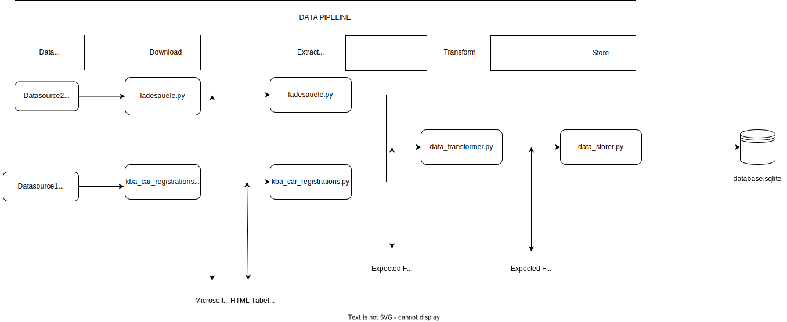

# Project Plan

## Summary
The project deals with the (temporal) connection between the approval of electric cars and the expansion of the charging infrastructure. The charging infrastructure is limited to those publicly reported to the Federal Network Agency. The data for the registration of electric cars takes into account the data published monthly by the Kraftfahrt-Bundesamt (Federal Motor Transport Authority)
## Rationale
Maps for charging stations exist in many places, but the goal of the project is to link the above data and present it in a descriptive way to give a user the relationship between electric cars and public charging stations at a given moment in Germany.
## Datasources

### Datasource1: Liste der Ladesäulen
* Metadata URL: /
* Data URL: https://www.bundesnetzagentur.de/SharedDocs/Downloads/DE/Sachgebiete/Energie/Unternehmen_Institutionen/E_Mobilitaet/Ladesaeulenregister_CSV.csv?__blob=publicationFile&v=46
* Data Type: CSV
This data source shows the exact coordinates of the charging stations, contains the charging points as well as their amperage and also indicates the commissioning of the station.

### Datasource2: Neuzulassung von Kraftfahrzeugen
* Metadata URL: /
* Data URL: https://www.kba.de/DE/Statistik/Produktkatalog/produkte/Fahrzeuge/fz8/fz8_gentab.html;jsessionid=FAB7EB31182B3E967B07899A2BE2623E.live21322?nn=3547466
* Data Type: HTML
This data source shows the monthly registration of electric cars. Since the data is published mixed either via HTML or XLSX, a small scraper has to be built here to analyze the page and merge the needed data.

### Datasource3: Neuzulassungen von Personenkraftwagen (PKW) nach Segmenten und Modellreihen im Jahr 2023 (FZ 11)
* Metadata URL: https://mobilithek.info/offers/573358146154541056
* Data URL: https://www.kba.de/SharedDocs/Downloads/DE/Statistik/Fahrzeuge/FZ11/fz11_2023_01.xlsx?__blob=publicationFile&v=5
* Data Type: HTML
The data source shows new passenger vehicle registrations by segment and model series for January 2023. These data sources also exist for other years and months.
[See the full list here](https://mobilithek.info/offers?searchString=%22Neuzulassungen%20von%20Personenkraftwagen%22&page=2)

## Work Packages
1. Analyze the Data of the different Datasources and their uses in this Project.
2. Analyze the Structure of second Datasource and build a Script to download and store the different statistics into a Database 
3. TBA
## Technology Stack
### Data engineering
In order to get information of the second Datasource it is necessary to build a small tool which is able to extract these Information.
For that the programming language Python will be used in combination with libraries like requests to get the website and beautifulsoup to analyze the Website and the Data.
Furthermore sqlite will be used to store the extracted Information in a database. To read CSV Files pandas will be used.
### Data exploration
Jupyter Notebook in combination with DB Browser
### Data analysis
Jupyter Notebook
### Data Pipeline

